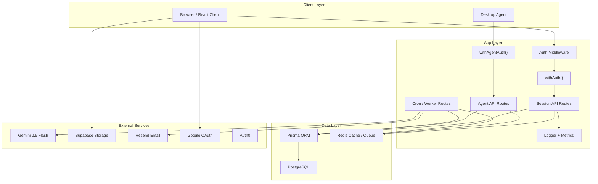

# System Architecture - EMS Pro

## Overview

EMS Pro is a multi-tenant HRMS built on Next.js 16, React 19, Prisma 7.4, and PostgreSQL. The current system includes 5 roles, 19 permissioned modules, 100+ API routes, 63 database models, AI-assisted workflows, and a desktop agent telemetry/reporting pipeline.

---

## Architecture Diagram

---

## Frontend

- App Router-based UI with role-aware dashboards
- Shared design system components for cards, dialogs, inputs, tables, tabs, and status surfaces
- Employee and Team Lead dashboards now include a personal To-Do list widget and an activity tracker widget
- Admin dashboard area now includes an agent-tracking page for workforce monitoring

---

## API Layer

The repository currently contains 100+ route handlers.

### Main route groups

| Prefix | Description |
| --- | --- |
| `/api/employees` | Employee CRUD, credentials, profile, documents |
| `/api/attendance` | Attendance, shifts, holidays, regularization, policies |
| `/api/time-tracker` | Check-in/out, heartbeat, break, history, status |
| `/api/payroll` | Payroll CRUD, config, import, run, payslip |
| `/api/performance` | Daily/monthly performance reviews |
| `/api/agent` | Device registration, heartbeat, config, commands, activity, idle events, report fetch |
| `/api/admin/agent` | Agent dashboard, device inventory, remote commands |
| `/api/cron` | AI performance evaluation, agent aggregation, agent reports, scheduled jobs |
| `/api/admin` | Sessions, metrics, analytics, performance, assets, agent management |

All session-auth routes use:

- `withAuth({ module, action })`
- `apiSuccess()` / `apiError()`
- organization scoping
- Zod validation for mutations

Desktop agent routes use:

- `withAgentAuth()`
- device API keys
- Zod validation via `lib/schemas/agent.ts`

---

## RBAC

Roles:

- CEO
- HR
- PAYROLL
- TEAM_LEAD
- EMPLOYEE

Modules:

- EMPLOYEES
- PAYROLL
- TEAMS
- PERFORMANCE
- FEEDBACK
- DASHBOARD
- REPORTS
- ATTENDANCE
- LEAVES
- TRAINING
- ANNOUNCEMENTS
- ASSETS
- DOCUMENTS
- TICKETS
- RECRUITMENT
- RESIGNATION
- ORGANIZATION
- SETTINGS
- WORKFLOWS
- AGENT_TRACKING

Actions:

- VIEW
- CREATE
- UPDATE
- DELETE
- REVIEW
- ASSIGN
- EXPORT
- IMPORT

---

## Database

The current Prisma schema has **63 models** and **38 enums**.

### Core HR models

- `Organization`
- `User`
- `Employee`
- `EmployeeProfile`
- `EmployeeAddress`
- `EmployeeBanking`
- `Department`
- `Team`
- `TeamMember`

### Operations models

- `Attendance`
- `TimeSession`
- `BreakEntry`
- `Leave`
- `Payroll`
- `ProvidentFund`
- `Training`
- `Asset`
- `Document`
- `Ticket`
- `Resignation`
- `CalendarEvent`

### Workflow and reporting

- `WorkflowTemplate`
- `WorkflowStep`
- `WorkflowInstance`
- `WorkflowAction`
- `SavedReport`
- `ReportSchedule`
- `Webhook`
- `WebhookDelivery`
- `AuditLog`

### AI and monitoring

- `PerformanceMetrics`
- `WeeklyScores`
- `AgentExecutionLogs`
- `Notifications`
- `AdminAlerts`

### Agent tracking

- `AgentDevice`
- `AgentCommand`
- `AgentActivitySnapshot`
- `AppUsageSummary`
- `WebsiteUsageSummary`
- `IdleEvent`
- `DailyActivityReport`

---

## Queue and Async Work

Redis-backed queue jobs currently include:

- webhook delivery
- agent aggregation
- agent report generation
- other import/export jobs

These flows are implemented in `lib/queue.ts`, worker routes, and webhook dispatch helpers.

---

## Integrations

- Supabase Storage for files
- Gemini for AI chat, performance analysis, and activity summaries
- Resend for transactional email delivery
- Google OAuth and optional Auth0 for sign-in
- Webhook subscriptions for downstream integrations

---

## Security Model

- Multi-tenant scoping via `organizationId`
- Session auth with NextAuth v5
- Route-level RBAC with `withAuth()`
- Device-level auth with `withAgentAuth()`
- Structured logging and request tracing
- Rate limiting via Redis with in-memory fallback
- Webhook signing via HMAC
- Session revocation through `UserSession`

---

## Key Libraries

| File | Purpose |
| --- | --- |
| `lib/auth.ts` | NextAuth config |
| `lib/security.ts` | Session route authorization |
| `lib/permissions.ts` | RBAC matrix and scoping helpers |
| `lib/agent-auth.ts` | Device auth for desktop agent routes |
| `lib/queue.ts` | Background job queue |
| `lib/webhooks.ts` | Outbound webhook dispatch |
| `lib/agent-report-generator.ts` | Daily activity report generation |
| `lib/activity-classifier.ts` | Activity categorization and productivity scoring |
| `lib/email.ts` | Email sending |
| `lib/logger.ts` | Structured logging |
| `lib/metrics.ts` | Metrics collection |
