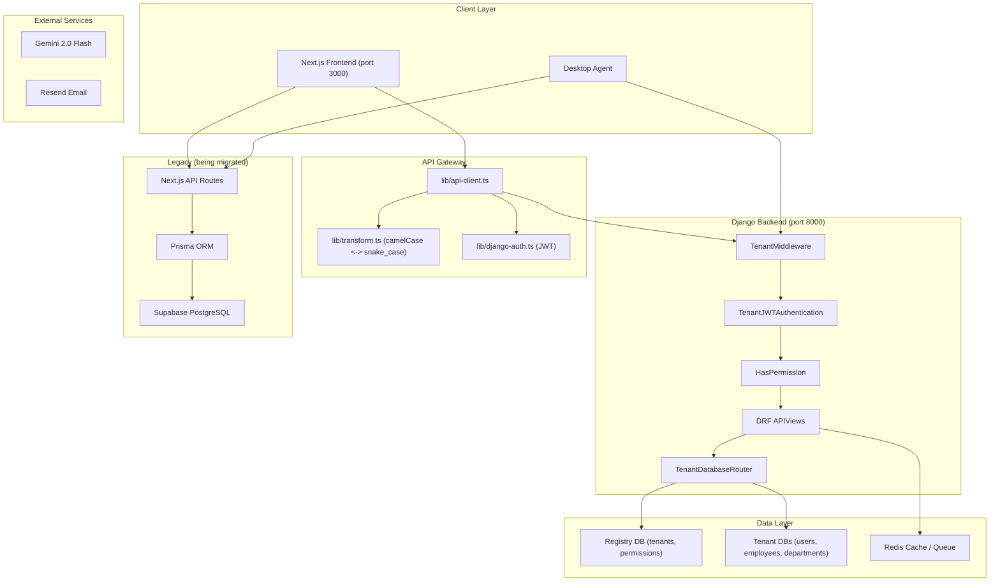

# System Architecture - EMS Pro

## Overview

EMS Pro is a multi-tenant HRMS with a **Next.js 16 / React 19 / TailwindCSS 3.4** frontend and a **Django 5.1 + Django REST Framework** backend (`backend/`) using DB-per-tenant PostgreSQL isolation, SimpleJWT authentication, and dynamic RBAC. The system has 7 roles, 18 modules (63 permission codenames), 142 API route handlers, 83+ database models, AI-assisted workflows, a multi-step approval workflow engine, and a desktop agent telemetry/reporting pipeline. 18 of 18 modules are fully migrated to Django (100% complete).

---

## Architecture Diagram (Target)



---

## Frontend

- App Router-based UI with role-aware dashboards
- Shared design system components for cards, dialogs, inputs, tables, tabs, and status surfaces
- Employee and Team Lead dashboards now include a personal To-Do list widget and an activity tracker widget
- Admin dashboard area now includes an agent-tracking page for workforce monitoring

---

## API Layer

The repository currently contains 142 route handlers.

### Main route groups

| Prefix | Description |
| --- | --- |
| `/api/employees` | Employee CRUD, credentials, profile, documents |
| `/api/attendance` | Attendance, shifts, holidays, regularization, policies |
| `/api/time-tracker` | Check-in/out, heartbeat, break, history, status |
| `/api/payroll` | Payroll CRUD, config, import, run, payslip |
| `/api/performance` | Daily/monthly reviews, Source One module (cycles, monthly, appraisals, eligibility, PIPs, signatures) with 3-tier row-level scoping |
| `/api/teams` | Team CRUD, membership, org chart, auto-sync from hierarchy |
| `/api/agent` | Device registration, heartbeat, config, commands, activity, idle events, report fetch |
| `/api/admin/agent` | Agent dashboard, device inventory, remote commands |
| `/api/cron` | AI performance evaluation, agent aggregation, agent reports, scheduled jobs |
| `/api/admin` | Sessions, metrics, analytics, performance, assets, agent management |

All session-auth routes use:

- `withAuth({ module, action })`
- `apiSuccess()` / `apiError()`
- organization scoping
- Zod validation for mutations

Desktop agent routes use:

- `withAgentAuth()`
- device API keys
- Zod validation via `lib/schemas/agent.ts`

---

## RBAC

### Next.js Static Roles (Fallback)

- CEO
- HR
- PAYROLL
- TEAM_LEAD
- EMPLOYEE

### Django Dynamic Roles (Primary — 7 roles, 63 codenames)

| Role | Permissions | Count |
| --- | --- | --- |
| admin | All 63 codenames | 63 |
| hr_manager | employees, attendance, leaves, performance, training, documents, tickets, recruitment, resignation, reimbursement, reports, teams, calendar, feedback, announcements, dashboard, users.view | 39 |
| payroll_admin | payroll (all), employees.view, attendance.view, leaves.view, reimbursement, reports.view/export, dashboard.view | 11 |
| team_lead | employees.view, attendance.view, leaves.view/approve, performance.view/review, training.view, teams, feedback, calendar.view, dashboard.view | 13 |
| recruiter | employees.view, recruitment, calendar, dashboard.view | 6 |
| hiring_manager | employees.view, recruitment.view, calendar.view, dashboard.view | 4 |
| interviewer | employees.view, recruitment.view, feedback, dashboard.view | 5 |
| viewer | employees.view, attendance.view, leaves.view, reports.view, dashboard.view | 5 |

Permission check chain: `withAuth()` → static matrix → Django codenames → functional roles → tenant admin bypass.

#### Performance Row-Level Scoping (3-Tier)

Beyond module-level RBAC, the performance module enforces row-level access control:

| Tier | Roles | Access |
| --- | --- | --- |
| Full Access | Admin, CEO, HR Manager | All records |
| Team Lead | Team Lead | Own + direct reports + team members |
| Employee | Employee, Viewer | Own records only |

Role determination uses the `UserRole` M2M table (not a User model field). `_is_full_access()` checks `is_tenant_admin` OR role slugs in `{admin, ceo, hr_manager}`. Detail views return 403 for out-of-scope records. Monthly review signing validates signer identity (employee signs own, manager signs direct report's, HR requires full-access role).

Modules:

- EMPLOYEES
- PAYROLL
- TEAMS
- PERFORMANCE
- FEEDBACK
- DASHBOARD
- REPORTS
- ATTENDANCE
- LEAVES
- TRAINING
- ANNOUNCEMENTS
- ASSETS
- DOCUMENTS
- TICKETS
- RECRUITMENT
- RESIGNATION
- ORGANIZATION
- SETTINGS
- WORKFLOWS
- AGENT_TRACKING

Actions:

- VIEW
- CREATE
- UPDATE
- DELETE
- REVIEW
- ASSIGN
- EXPORT
- IMPORT

---

## Database

The Django backend now hosts 30 domain apps with their own models. Combined with remaining Prisma models (retained for legacy/local-only use), the total model count exceeds **83 models** across both systems.

### Core HR models

- `Organization`
- `User`
- `Employee`
- `EmployeeProfile`
- `EmployeeAddress`
- `EmployeeBanking`
- `Department`
- `Team`
- `TeamMember`

### Operations models

- `Attendance`
- `TimeSession`
- `BreakEntry`
- `Leave`
- `Payroll`
- `ProvidentFund`
- `Training`
- `Asset`
- `Document`
- `Ticket`
- `Resignation`
- `CalendarEvent`

### Workflow and reporting

- `WorkflowTemplate`
- `WorkflowStep`
- `WorkflowInstance`
- `WorkflowAction`
- `SavedReport`
- `ReportSchedule`
- `Webhook`
- `WebhookDelivery`
- `AuditLog`

### Performance — Source One (Django)

- `ReviewCycle` — Review cycle definitions (annual, six-monthly)
- `MonthlyReview` — Monthly performance reviews with digital signatures
- `Appraisal` — Annual and six-monthly appraisals linked to review cycles
- `PIP` — Performance improvement plans (60-day, 90-day)

### AI and monitoring

- `PerformanceMetrics`
- `WeeklyScores`
- `AgentExecutionLogs`
- `Notifications`
- `AdminAlerts`

### Agent tracking (Django)

- `AgentDevice` -- Desktop agent device registry (machine_id, status, platform, heartbeat)
- `ActivitySession` -- Continuous activity period on a device (active/idle seconds, keystrokes, clicks)
- `AppUsage` -- Per-app time tracking within a session (categorized: PRODUCTIVE/NEUTRAL/UNPRODUCTIVE)
- `WebsiteVisit` -- Per-domain time tracking within a session (categorized)
- `IdleEvent` -- Idle period detected (10+ min threshold, employee response)
- `AgentCommand` -- Command queue for devices (SUSPEND, RESUME, KILL_SWITCH, etc.)
- `Screenshot` -- Screenshot captured during a session (image URL, timestamp)
- `DailyActivitySummary` -- Pre-computed daily report (productivity score, top apps/sites, clock times)

### Agent tracking (Prisma legacy)

- `AgentDevice`
- `AgentCommand`
- `AgentActivitySnapshot`
- `AppUsageSummary`
- `WebsiteUsageSummary`
- `IdleEvent`
- `DailyActivityReport`

---

## Queue and Async Work

Redis-backed queue jobs currently include:

- webhook delivery
- agent aggregation
- agent report generation
- other import/export jobs

These flows are implemented in `lib/queue.ts`, worker routes, and webhook dispatch helpers.

---

## Integrations

- Supabase Storage for files
- Gemini for AI chat, performance analysis, and activity summaries
- Resend for transactional email delivery
- Google OAuth and optional Auth0 for sign-in
- Webhook subscriptions for downstream integrations

---

## Feature Flags

Django's feature flag system controls Next.js UI module visibility:

- Global `FeatureFlag` catalog in registry DB (14 flags: employees, attendance, leave, payroll, performance, training, recruitment, documents, assets, help_desk, announcements, reimbursement, workflows, teams)
- Per-tenant `TenantFeature` overrides in tenant DB
- `fetchFeatureFlags()` in AuthContext converts Django array → `Record<string, boolean>`
- Sidebar checks `isModuleEnabled()` before showing nav items
- Route protection in AuthContext redirects to `/` for disabled modules
- Seeded via: `python manage.py seed_features`

## Audit Logging

- `auditLog()` in `lib/logger.ts` fires events to Django `/api/v1/audit-logs/` (POST, fire-and-forget)
- Django `apps/audit/` stores: action, resource, resource_id, user_id, organization_id, source, details (JSON), ip_address, timestamp
- Also logs locally via structured JSON logger

## Security Model

- **Schema-per-tenant** PostgreSQL isolation — each tenant gets a separate database
- **Legacy**: Multi-tenant scoping via `organizationId` (shared schema) for Prisma-only models
- JWT auth via Django SimpleJWT with tenant-aware token claims (`tenant_id`, `tenant_slug`, `employee_id`)
- Tenant context from JWT: `decodeJwtPayload()` + `persistTenantFromJwt()` extract and store tenant info
- `X-Tenant-Slug` header sent on every request via `api-client.ts`, allowed via `CORS_ALLOW_HEADERS`
- Route-level RBAC with `HasPermission` (Django) and `withAuth()` (Next.js) with Django codename fallback
- Device-level auth with `withAgentAuth()` for desktop agent routes
- First-login password change enforcement (`must_change_password` flag)
- Structured logging and request tracing + Django audit log dispatch
- Rate limiting: per-IP 60/min (Next.js middleware) + per-user 1000/hr (matches Django throttle) + 5 login/min, 3 register/hour (Django)
- Webhook signing via HMAC
- Session revocation through `UserSession` + Django token blacklist

---

## Key Libraries

| File | Purpose |
| --- | --- |
| `lib/api-client.ts` | Centralized HTTP client for Django backend |
| `lib/django-auth.ts` | Django JWT login, register, refresh, logout, getMe |
| `lib/transform.ts` | camelCase/snake_case transforms for API communication |
| `lib/permissions.ts` | RBAC matrix and scoping helpers |
| `lib/auth.ts` | Legacy NextAuth config (being phased out) |
| `lib/security.ts` | Legacy session route authorization |
| `lib/agent-auth.ts` | Device auth for desktop agent routes |
| `lib/queue.ts` | Background job queue |
| `lib/webhooks.ts` | Outbound webhook dispatch |
| `lib/agent-report-generator.ts` | Daily activity report generation |
| `lib/activity-classifier.ts` | Activity categorization and productivity scoring |
| `lib/email.ts` | Email sending |
| `lib/logger.ts` | Structured logging |
| `lib/metrics.ts` | Metrics collection |

---

## Django Backend (`backend/`)

The new backend follows the HiringNow platform architecture:

### Apps

| App | Purpose | Status |
| --- | --- | --- |
| `apps.tenants` | Multi-tenant registry, tenant DB management, Permission + FeatureFlag models | From HiringNow |
| `apps.users` | User model + UserSession + JWT auth | Extended |
| `apps.rbac` | Dynamic roles, permissions, UserRole. `seed_rbac` command: 7 roles, 63 codenames, 18 modules | Extended |
| `apps.employees` | Employee CRUD + sub-profiles (Profile, Address, Banking) | Extended |
| `apps.departments` | Department CRUD with employee count guards | New |
| `apps.dashboard` | Stats API (department split, status counts, salary, logins) | Done |
| `apps.features` | Feature flags per tenant. `seed_features` command: 14 module flags | Extended |
| `apps.audit` | AuditLog model + REST API. Receives events from Next.js `auditLog()` | New |
| `apps.performance` | Source One performance module: ReviewCycle, MonthlyReview, Appraisal, PIP. 14 endpoints with RBAC + digital signatures + 3-tier row-level scoping | New |
| `apps.teams` | Team CRUD, membership management, org chart, auto-sync from `reporting_to` hierarchy. `sync_all_teams()` service | New |
| `apps.agent` | Desktop agent tracking: 8 models (AgentDevice, ActivitySession, AppUsage, WebsiteVisit, IdleEvent, AgentCommand, Screenshot, DailyActivitySummary). 9 endpoints. Categorization engine (120+ apps, 60+ domains). Productivity scoring + daily summary caching + auto clock-in/out | New |
| `apps.workflows` | Multi-step approval workflows: 4 models (WorkflowTemplate, WorkflowStep, WorkflowInstance, WorkflowAction). 6 entity types. Auto-trigger via `initiate_workflow()`. 5 endpoints | New |

### Management Commands

| Command | Purpose |
| --- | --- |
| `python manage.py seed_rbac --tenant-slug <slug>` | Seed 63 permission codenames + 7 roles in tenant DB |
| `python manage.py seed_features` | Seed 14 module feature flags in registry DB |

### API Endpoints (Django)

| Endpoint | Method | Purpose |
| --- | --- | --- |
| `/api/v1/auth/register/` | POST | Tenant + admin user registration |
| `/api/v1/auth/login/` | POST | JWT login with tenant slug |
| `/api/v1/auth/refresh/` | POST | Token refresh |
| `/api/v1/auth/logout/` | POST | Token blacklist |
| `/api/v1/auth/me/` | GET/PUT | Current user profile |
| `/api/v1/auth/change-password/` | POST | Password change (supports first-login) |
| `/api/v1/employees/` | GET/POST | List (paginated) / Create employee |
| `/api/v1/employees/{id}/` | GET/PUT/DELETE | Detail / Update / Soft-delete |
| `/api/v1/employees/{id}/credentials/` | POST | Reset password, return temp_password |
| `/api/v1/employees/managers/` | GET | Active employees for manager dropdown |
| `/api/v1/departments/` | GET/POST | List / Create department |
| `/api/v1/departments/{id}/` | GET/DELETE | Detail / Delete (guarded) |
| `/api/v1/dashboard/` | GET | Dashboard aggregated stats |
| `/api/v1/dashboard/logins/` | GET | Login analytics |
| `/api/v1/performance/cycles/` | GET/POST | Review cycle management |
| `/api/v1/performance/monthly/` | GET/POST | Monthly review CRUD |
| `/api/v1/performance/monthly/{id}/` | GET/PUT | Monthly review detail |
| `/api/v1/performance/monthly/{id}/sign/` | POST | Digital signature collection |
| `/api/v1/performance/appraisals/` | GET/POST | Appraisal management |
| `/api/v1/performance/appraisals/{id}/` | GET/PUT | Appraisal detail |
| `/api/v1/performance/eligibility/` | GET | Active employee eligibility |
| `/api/v1/performance/pip/` | GET/POST | PIP management |
| `/api/v1/performance/pip/{id}/` | GET/PUT | PIP detail |
| `/api/v1/teams/` | GET/POST | Team list / Create |
| `/api/v1/teams/{id}/` | GET/PUT/DELETE | Team detail / Update / Delete |
| `/api/v1/teams/{id}/members/` | POST/DELETE | Add/remove team member |
| `/api/v1/teams/sync-from-hierarchy/` | POST | Auto-create teams from hierarchy |
| `/api/v1/teams/org-chart/` | GET | Org chart tree |
| `/api/v1/agent/register/` | POST | Device registration (idempotent) |
| `/api/v1/agent/heartbeat/` | POST | Heartbeat ping |
| `/api/v1/agent/ingest/` | POST | Bulk activity data ingest |
| `/api/v1/agent/screenshot/upload/` | POST | Screenshot upload (base64) |
| `/api/v1/agent/commands/` | GET | Poll pending commands |
| `/api/v1/agent/daily-report/` | GET | Employee daily activity report |
| `/api/v1/admin/agent/dashboard/` | GET | Admin agent tracking dashboard |
| `/api/v1/admin/agent/devices/` | GET/POST | Device list / status update |
| `/api/v1/admin/agent/command/` | POST | Issue command to device |
| `/api/v1/workflows/templates/` | GET/POST | Workflow template CRUD |
| `/api/v1/workflows/templates/{id}/` | GET/PUT/DELETE | Template detail/update/delete |
| `/api/v1/workflows/instances/` | GET/POST | Workflow instance CRUD |
| `/api/v1/workflows/instances/{id}/` | GET | Instance detail |
| `/api/v1/workflows/instances/{id}/action/` | POST | Approve/reject/return step |

### Data Migration

A migration script at `backend/scripts/migrate_ems_data.py` handles:

- Supabase PostgreSQL → Django tenant DBs
- User role mapping (EMS roles → Django roles)
- Department, Employee, and sub-profile migration
- bcrypt hash format adaptation
- Dry-run mode for validation

---

## Agent Tracking System

### Desktop Agent (Electron)

The desktop agent (`time-agent/`) is an Electron 28 application that runs in the system tray and collects employee activity data. It communicates directly with the Django backend.

```text
Employee Machine                           Django Backend
+-----------------------+                  +---------------------------+
| Electron Time Agent   |                  | apps/agent/               |
|                       |  POST /register  |                           |
| app-tracker.js ------>|----------------->| AgentRegisterView         |
| idle-detector.js      |  POST /heartbeat |                           |
| screenshot-capture.js |----------------->| AgentHeartbeatView        |
| sync-engine.js ------>|  POST /ingest    |                           |
|                       |----------------->| AgentIngestView           |
|                       |  POST /screenshot|  categorization.py        |
|                       |----------------->|  productivity.py          |
|                       |  GET /commands   |  services.py              |
|                       |<-----------------| AgentPollCommandsView     |
+-----------------------+                  +---------------------------+
```

Key components:

- **app-tracker.js**: Polls the active window every 5 seconds via PowerShell (Windows) or osascript (macOS). Tracks per-app time and window titles. Estimates keystrokes/clicks from idle time patterns
- **idle-detector.js**: Uses `powerMonitor.getSystemIdleTime()` every 10 seconds. Shows popup after 10 minutes idle. Employee can respond: "Was Working" / "Took a Break" / auto "No Response" after 5 minutes
- **screenshot-capture.js**: Uses `desktopCapturer.getSources()` to capture screen. Randomized interval (8-12 minutes). Saves JPEG to temp directory. Gracefully handles missing desktopCapturer
- **sync-engine.js**: Orchestrates device registration, heartbeat (30s), and data sync (60s). Uploads screenshots as base64 first, then sends bulk ingest payload. Caches device ID after registration. Queues data on network failure for retry

### Django Agent App

The backend (`apps/agent/`) processes and stores agent data:

- **8 models**: AgentDevice, ActivitySession, AppUsage, WebsiteVisit, IdleEvent, AgentCommand, Screenshot, DailyActivitySummary
- **Categorization engine** (`categorization.py`): 120+ app patterns and 60+ domain patterns. Categories: PRODUCTIVE, NEUTRAL, UNPRODUCTIVE, UNCATEGORIZED. Case-insensitive substring matching
- **Productivity scoring** (`productivity.py`): Weighted formula -- 40% productive time ratio, 25% activity intensity (keystrokes+clicks per hour), 20% focus time (productive stretches > 25 min), 15% low idle ratio. Score range: 0.0 - 1.0
- **Daily summary** (`services.py`): `compute_daily_summary()` calculates and caches a `DailyActivitySummary` per employee per date. `sync_agent_attendance()` derives clock-in/out from first/last activity sessions

---

## Workflow Engine

### Architecture

The workflow engine (`apps/workflows/`) provides multi-step approval workflows that can be attached to any entity type.

```text
Template (PUBLISHED)          Instance Lifecycle
+-------------------+        +-------+     +-------------+     +----------+
| WorkflowTemplate  |------->| PENDING| --> | IN_PROGRESS | --> | APPROVED |
|   steps: [        |        +-------+     +------+------+     +----------+
|     Step 1: Mgr   |                             |
|     Step 2: HR    |                     +-------v--------+
|   ]               |                     | Action: REJECT |
+-------------------+                     +-------+--------+
                                                  |
                                          +-------v--------+
                                          |   REJECTED     |
                                          +----------------+
```

- **WorkflowTemplate**: Defines a reusable approval flow. Has an `entity_type` (LEAVE, REIMBURSEMENT, RESIGNATION, ASSET_REQUEST, ONBOARDING, OFFBOARDING) and a `status` (DRAFT, PUBLISHED, ARCHIVED)
- **WorkflowStep**: Ordered step within a template. Each step has an `approver_type` (REPORTING_MANAGER, HR, DEPARTMENT_HEAD, SPECIFIC_EMPLOYEE, AUTO_APPROVE) and an SLA in hours
- **WorkflowInstance**: A running workflow for a specific entity (e.g., a leave request). Tracks `current_step` and `status`
- **WorkflowAction**: A decision (APPROVED, REJECTED, RETURNED) by an actor on a step

### Auto-Trigger Integration

`initiate_workflow()` in `apps/workflows/services.py` is called when a leave request or resignation is created. If a PUBLISHED template exists for that entity type, a WorkflowInstance is automatically created with status `IN_PROGRESS`. If no template exists, the module proceeds without a workflow.

---

## Future Roadmap

### Phase 1 (Complete): Django Backend MVP

- Departments app, Employee extensions, User extensions, RBAC seed, Dashboard API
- Schema-per-tenant database routing
- JWT claims with employee_id and must_change_password

### Phase 2 (Complete): Frontend Adaptation

- API client with camelCase/snake_case transforms
- Django JWT auth helpers replacing NextAuth
- AuthContext rewrite for Django backend
- Employee page and login page adapted

### Phase 3 (Complete): HiringNow Integration (9 Sprints)

- RBAC alignment: Django codenames + Next.js static matrix dual-layer
- API path alignment: All feature API clients → Django `/api/v1/` endpoints
- Multi-tenancy: JWT tenant claim extraction, `X-Tenant-Slug` header, CORS config
- Middleware: Per-user rate limiting, audit log dispatch to Django
- Data contracts: Envelope match, pagination remap, snake_case transform
- Feature flags: Django feature flag system → Sidebar + route gating
- Django RBAC expansion: 7 roles, 63 codenames, 18 modules
- Django feature flag seeding: 14 module flags
- Django audit logs: New `apps/audit/` app + REST API + CORS headers

### Phase 4 (Next): Data Migration

- Run migration script against Supabase
- Validate counts and integrity
- Run Django migrations: `makemigrations audit` + `migrate`
- Run seed commands: `seed_rbac` + `seed_features`
- Parallel operation period (both backends live)

### Phase 5 (Planned): Full Migration

- Migrate remaining Next.js API routes to Django (attendance, payroll, leave, etc.)
- Remove Prisma and Supabase dependencies
- ~~Migrate agent tracking APIs to Django~~ (Complete -- `apps/agent/`)
- ~~Add workflow engine to Django~~ (Complete -- `apps/workflows/`)
- Add FastAPI AI microservice for Gemini integration

### Phase 6 (Planned): Production Hardening

- End-to-end and integration tests
- CI/CD pipeline (pytest + ruff + vitest)
- Docker Compose with all services
- Performance benchmarking and optimization
