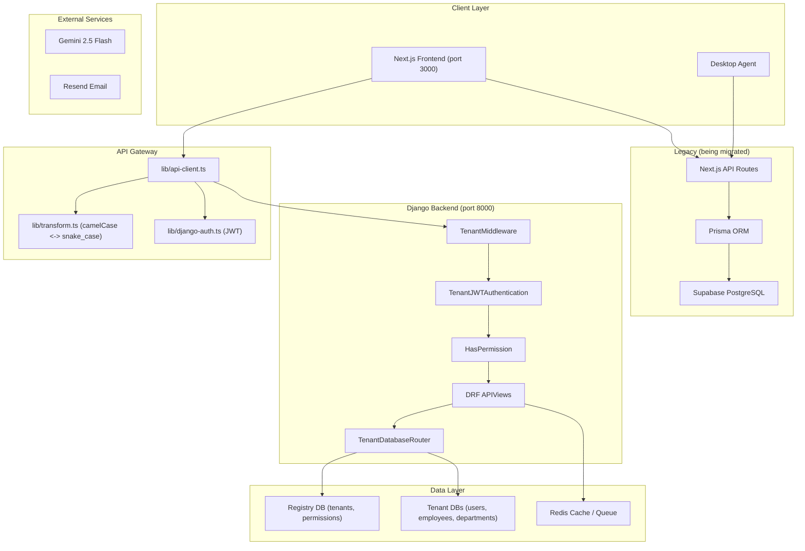

# System Architecture - EMS Pro

## Overview

EMS Pro is a multi-tenant HRMS with a **Next.js 16 / React 19 / TailwindCSS 3.4** frontend and a **Django 5.1 + Django REST Framework** backend (`backend/`) using DB-per-tenant PostgreSQL isolation, SimpleJWT authentication, and dynamic RBAC. The system has 7 roles, 18 modules (63 permission codenames), 100+ API routes, 64 database models, AI-assisted workflows, and a desktop agent telemetry/reporting pipeline. 12 of 18 modules are fully migrated to Django; 6 remain partial (Payroll, Performance, Feedback, Reports, Settings, Dashboard).

---

## Architecture Diagram (Target)

---

## Frontend

- App Router-based UI with role-aware dashboards
- Shared design system components for cards, dialogs, inputs, tables, tabs, and status surfaces
- Employee and Team Lead dashboards now include a personal To-Do list widget and an activity tracker widget
- Admin dashboard area now includes an agent-tracking page for workforce monitoring

---

## API Layer

The repository currently contains 100+ route handlers.

### Main route groups

| Prefix | Description |
| --- | --- |
| `/api/employees` | Employee CRUD, credentials, profile, documents |
| `/api/attendance` | Attendance, shifts, holidays, regularization, policies |
| `/api/time-tracker` | Check-in/out, heartbeat, break, history, status |
| `/api/payroll` | Payroll CRUD, config, import, run, payslip |
| `/api/performance` | Daily/monthly performance reviews |
| `/api/agent` | Device registration, heartbeat, config, commands, activity, idle events, report fetch |
| `/api/admin/agent` | Agent dashboard, device inventory, remote commands |
| `/api/cron` | AI performance evaluation, agent aggregation, agent reports, scheduled jobs |
| `/api/admin` | Sessions, metrics, analytics, performance, assets, agent management |

All session-auth routes use:

- `withAuth({ module, action })`
- `apiSuccess()` / `apiError()`
- organization scoping
- Zod validation for mutations

Desktop agent routes use:

- `withAgentAuth()`
- device API keys
- Zod validation via `lib/schemas/agent.ts`

---

## RBAC

### Next.js Static Roles (Fallback)

- CEO
- HR
- PAYROLL
- TEAM_LEAD
- EMPLOYEE

### Django Dynamic Roles (Primary — 7 roles, 63 codenames)

| Role | Permissions | Count |
| --- | --- | --- |
| admin | All 63 codenames | 63 |
| hr_manager | employees, attendance, leaves, performance, training, documents, tickets, recruitment, resignation, reimbursement, reports, teams, calendar, feedback, announcements, dashboard, users.view | 39 |
| payroll_admin | payroll (all), employees.view, attendance.view, leaves.view, reimbursement, reports.view/export, dashboard.view | 11 |
| team_lead | employees.view, attendance.view, leaves.view/approve, performance.view/review, training.view, teams, feedback, calendar.view, dashboard.view | 13 |
| recruiter | employees.view, recruitment, calendar, dashboard.view | 6 |
| hiring_manager | employees.view, recruitment.view, calendar.view, dashboard.view | 4 |
| interviewer | employees.view, recruitment.view, feedback, dashboard.view | 5 |
| viewer | employees.view, attendance.view, leaves.view, reports.view, dashboard.view | 5 |

Permission check chain: `withAuth()` → static matrix → Django codenames → functional roles → tenant admin bypass.

Modules:

- EMPLOYEES
- PAYROLL
- TEAMS
- PERFORMANCE
- FEEDBACK
- DASHBOARD
- REPORTS
- ATTENDANCE
- LEAVES
- TRAINING
- ANNOUNCEMENTS
- ASSETS
- DOCUMENTS
- TICKETS
- RECRUITMENT
- RESIGNATION
- ORGANIZATION
- SETTINGS
- WORKFLOWS
- AGENT_TRACKING

Actions:

- VIEW
- CREATE
- UPDATE
- DELETE
- REVIEW
- ASSIGN
- EXPORT
- IMPORT

---

## Database

The current Prisma schema has **63 models** and **38 enums**.

### Core HR models

- `Organization`
- `User`
- `Employee`
- `EmployeeProfile`
- `EmployeeAddress`
- `EmployeeBanking`
- `Department`
- `Team`
- `TeamMember`

### Operations models

- `Attendance`
- `TimeSession`
- `BreakEntry`
- `Leave`
- `Payroll`
- `ProvidentFund`
- `Training`
- `Asset`
- `Document`
- `Ticket`
- `Resignation`
- `CalendarEvent`

### Workflow and reporting

- `WorkflowTemplate`
- `WorkflowStep`
- `WorkflowInstance`
- `WorkflowAction`
- `SavedReport`
- `ReportSchedule`
- `Webhook`
- `WebhookDelivery`
- `AuditLog`

### AI and monitoring

- `PerformanceMetrics`
- `WeeklyScores`
- `AgentExecutionLogs`
- `Notifications`
- `AdminAlerts`

### Agent tracking

- `AgentDevice`
- `AgentCommand`
- `AgentActivitySnapshot`
- `AppUsageSummary`
- `WebsiteUsageSummary`
- `IdleEvent`
- `DailyActivityReport`

---

## Queue and Async Work

Redis-backed queue jobs currently include:

- webhook delivery
- agent aggregation
- agent report generation
- other import/export jobs

These flows are implemented in `lib/queue.ts`, worker routes, and webhook dispatch helpers.

---

## Integrations

- Supabase Storage for files
- Gemini for AI chat, performance analysis, and activity summaries
- Resend for transactional email delivery
- Google OAuth and optional Auth0 for sign-in
- Webhook subscriptions for downstream integrations

---

## Feature Flags

Django's feature flag system controls Next.js UI module visibility:

- Global `FeatureFlag` catalog in registry DB (14 flags: employees, attendance, leave, payroll, performance, training, recruitment, documents, assets, help_desk, announcements, reimbursement, workflows, teams)
- Per-tenant `TenantFeature` overrides in tenant DB
- `fetchFeatureFlags()` in AuthContext converts Django array → `Record<string, boolean>`
- Sidebar checks `isModuleEnabled()` before showing nav items
- Route protection in AuthContext redirects to `/` for disabled modules
- Seeded via: `python manage.py seed_features`

## Audit Logging

- `auditLog()` in `lib/logger.ts` fires events to Django `/api/v1/audit-logs/` (POST, fire-and-forget)
- Django `apps/audit/` stores: action, resource, resource_id, user_id, organization_id, source, details (JSON), ip_address, timestamp
- Also logs locally via structured JSON logger

## Security Model

- **Schema-per-tenant** PostgreSQL isolation — each tenant gets a separate database
- **Legacy**: Multi-tenant scoping via `organizationId` (shared schema) for Prisma-only models
- JWT auth via Django SimpleJWT with tenant-aware token claims (`tenant_id`, `tenant_slug`, `employee_id`)
- Tenant context from JWT: `decodeJwtPayload()` + `persistTenantFromJwt()` extract and store tenant info
- `X-Tenant-Slug` header sent on every request via `api-client.ts`, allowed via `CORS_ALLOW_HEADERS`
- Route-level RBAC with `HasPermission` (Django) and `withAuth()` (Next.js) with Django codename fallback
- Device-level auth with `withAgentAuth()` for desktop agent routes
- First-login password change enforcement (`must_change_password` flag)
- Structured logging and request tracing + Django audit log dispatch
- Rate limiting: per-IP 60/min (Next.js middleware) + per-user 1000/hr (matches Django throttle) + 5 login/min, 3 register/hour (Django)
- Webhook signing via HMAC
- Session revocation through `UserSession` + Django token blacklist

---

## Key Libraries

| File | Purpose |
| --- | --- |
| `lib/api-client.ts` | Centralized HTTP client for Django backend |
| `lib/django-auth.ts` | Django JWT login, register, refresh, logout, getMe |
| `lib/transform.ts` | camelCase/snake_case transforms for API communication |
| `lib/permissions.ts` | RBAC matrix and scoping helpers |
| `lib/auth.ts` | Legacy NextAuth config (being phased out) |
| `lib/security.ts` | Legacy session route authorization |
| `lib/agent-auth.ts` | Device auth for desktop agent routes |
| `lib/queue.ts` | Background job queue |
| `lib/webhooks.ts` | Outbound webhook dispatch |
| `lib/agent-report-generator.ts` | Daily activity report generation |
| `lib/activity-classifier.ts` | Activity categorization and productivity scoring |
| `lib/email.ts` | Email sending |
| `lib/logger.ts` | Structured logging |
| `lib/metrics.ts` | Metrics collection |

---

## Django Backend (`backend/`)

The new backend follows the HiringNow platform architecture:

### Apps

| App | Purpose | Status |
| --- | --- | --- |
| `apps.tenants` | Multi-tenant registry, tenant DB management, Permission + FeatureFlag models | From HiringNow |
| `apps.users` | User model + UserSession + JWT auth | Extended |
| `apps.rbac` | Dynamic roles, permissions, UserRole. `seed_rbac` command: 7 roles, 63 codenames, 18 modules | Extended |
| `apps.employees` | Employee CRUD + sub-profiles (Profile, Address, Banking) | Extended |
| `apps.departments` | Department CRUD with employee count guards | New |
| `apps.dashboard` | Stats API (department split, status counts, salary, logins) | New |
| `apps.features` | Feature flags per tenant. `seed_features` command: 14 module flags | Extended |
| `apps.audit` | AuditLog model + REST API. Receives events from Next.js `auditLog()` | New |

### Management Commands

| Command | Purpose |
| --- | --- |
| `python manage.py seed_rbac --tenant-slug <slug>` | Seed 63 permission codenames + 7 roles in tenant DB |
| `python manage.py seed_features` | Seed 14 module feature flags in registry DB |

### API Endpoints (Django)

| Endpoint | Method | Purpose |
| --- | --- | --- |
| `/api/v1/auth/register/` | POST | Tenant + admin user registration |
| `/api/v1/auth/login/` | POST | JWT login with tenant slug |
| `/api/v1/auth/refresh/` | POST | Token refresh |
| `/api/v1/auth/logout/` | POST | Token blacklist |
| `/api/v1/auth/me/` | GET/PUT | Current user profile |
| `/api/v1/auth/change-password/` | POST | Password change (supports first-login) |
| `/api/v1/employees/` | GET/POST | List (paginated) / Create employee |
| `/api/v1/employees/{id}/` | GET/PUT/DELETE | Detail / Update / Soft-delete |
| `/api/v1/employees/{id}/credentials/` | POST | Reset password, return temp_password |
| `/api/v1/employees/managers/` | GET | Active employees for manager dropdown |
| `/api/v1/departments/` | GET/POST | List / Create department |
| `/api/v1/departments/{id}/` | GET/DELETE | Detail / Delete (guarded) |
| `/api/v1/dashboard/` | GET | Dashboard aggregated stats |
| `/api/v1/dashboard/logins/` | GET | Login analytics |

### Data Migration

A migration script at `backend/scripts/migrate_ems_data.py` handles:

- Supabase PostgreSQL → Django tenant DBs
- User role mapping (EMS roles → Django roles)
- Department, Employee, and sub-profile migration
- bcrypt hash format adaptation
- Dry-run mode for validation

---

## Future Roadmap

### Phase 1 (Complete): Django Backend MVP

- Departments app, Employee extensions, User extensions, RBAC seed, Dashboard API
- Schema-per-tenant database routing
- JWT claims with employee_id and must_change_password

### Phase 2 (Complete): Frontend Adaptation

- API client with camelCase/snake_case transforms
- Django JWT auth helpers replacing NextAuth
- AuthContext rewrite for Django backend
- Employee page and login page adapted

### Phase 3 (Complete): HiringNow Integration (9 Sprints)

- RBAC alignment: Django codenames + Next.js static matrix dual-layer
- API path alignment: All feature API clients → Django `/api/v1/` endpoints
- Multi-tenancy: JWT tenant claim extraction, `X-Tenant-Slug` header, CORS config
- Middleware: Per-user rate limiting, audit log dispatch to Django
- Data contracts: Envelope match, pagination remap, snake_case transform
- Feature flags: Django feature flag system → Sidebar + route gating
- Django RBAC expansion: 7 roles, 63 codenames, 18 modules
- Django feature flag seeding: 14 module flags
- Django audit logs: New `apps/audit/` app + REST API + CORS headers

### Phase 4 (Next): Data Migration

- Run migration script against Supabase
- Validate counts and integrity
- Run Django migrations: `makemigrations audit` + `migrate`
- Run seed commands: `seed_rbac` + `seed_features`
- Parallel operation period (both backends live)

### Phase 5 (Planned): Full Migration

- Migrate remaining Next.js API routes to Django (attendance, payroll, leave, etc.)
- Remove Prisma and Supabase dependencies
- Migrate agent tracking APIs to Django
- Add FastAPI AI microservice for Gemini integration

### Phase 6 (Planned): Production Hardening

- End-to-end and integration tests
- CI/CD pipeline (pytest + ruff + vitest)
- Docker Compose with all services
- Performance benchmarking and optimization
